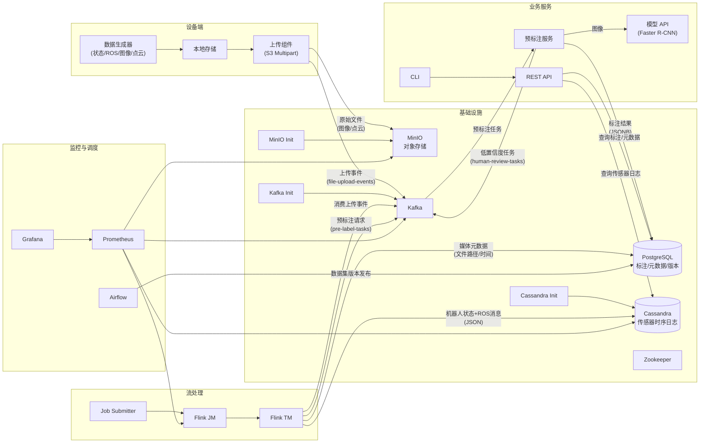

# RobotLoop — 机器人多模态数据闭环平台 Demo

RobotLoop 是一个面向**机器人/无人系统**的端到端数据闭环系统，完整演示从设备端数据生成、弱网断点续传、云端流处理、冷热存储、自动预标注到监控与开发者工具链的全链路。适用于自动驾驶、仓储
AGV、无人机、机械臂遥操作等场景。

本 Demo 涵盖：

- 设备端 → 云端的数据自动化上传管道（支持断点续传）
- 基于 Kafka + Flink 的实时流处理
- 多模态数据（机器人状态、ROS 消息、图像、LiDAR）的元数据管理与自动预标注
- 存储分层：Cassandra 存储高频传感器时序日志，PostgreSQL 存储标注结果与业务元数据，MinIO/S3 存储原始文件
- Airflow 数据管道调度与数据集版本管理
- REST API 与命令行工具链
- Prometheus + Grafana 全链路监控

## 架构图

## 项目结构

robotloop/  
├── README.md  
├── docker-compose.yml  
├── .env.example  
├── Makefile  
├── device/ # 设备端模拟  
│ ├── Dockerfile  
│ ├── generator.py # 生成模拟机器人数据（ROS 消息、图像、点云）  
│ ├── uploader.py # S3 断点续传上传 + Kafka 事件发送  
│ ├── start.sh # 设备模拟器启动脚本  
│ ├── sample.jpg # 预置的真实图片（用于模型检测）  
│ └── requirements.txt  
├── cloud/ # 云端服务  
│ ├── flink/ # Flink 作业  
│ │ ├── Dockerfile  
│ │ ├── robot_stream_job.py # 生产级 PyFlink 作业（消费 Kafka 并处理）  
│ │ └── requirements.txt  
│ ├── api/ # REST API  
│ │ ├── Dockerfile  
│ │ ├── main.py  
│ │ └── requirements.txt  
│ ├── preprocessing/ # 预标注服务  
│ │ ├── Dockerfile  
│ │ ├── pre_label_service.py  
│ │ └── requirements.txt  
│ ├── model_api/ # 轻量级模型推理 API  
│ │ ├── Dockerfile  
│ │ ├── model_api.py # Faster R-CNN MobileNetV3  
│ │ └── requirements.txt  
│ └── storage/ # 数据库初始化脚本  
│ └── init-schema.sql  
├── airflow/ # Airflow 调度  
│ ├── dags/  
│ │ └── dataset_release.py # 每日数据集质量检查与版本发布  
│ ├── plugins/  
│ └── requirements.txt  
├── infra/ # 基础设施配置  
│ ├── kafka/  
│ │ └── create-topics.sh  
│ ├── prometheus/  
│ │ └── prometheus.yml  
│ ├── grafana/  
│ │ └── dashboards/  
│ │ └── skyLoop.json  
│ └── minio-init/  
│ └── init.sh  
├── tools/ # 开发者 CLI  
│ ├── Dockerfile  
│ ├── cli.py  
│ └── requirements.txt  
└── tests/ # 测试（可选）

## 快速开始

### 1. 前置条件

- Docker & Docker Compose
- 至少 12 GB 可用内存（推荐 16 GB 以上）（含模型推理）

### 2. 启动所有服务

`cp .env.example .env`  
`docker-compose up -d`

等待所有容器启动（首次构建约 3~5 分钟，模型自动下载）。

### 3. 触发数据闭环

设备模拟器会在基础设施就绪后自动执行一次数据生成与上传，完成后容器退出。
如需再次生成新数据：

`docker-compose rm -f device-simulator`  
`docker-compose up -d device-simulator`

### 4. 查看 Airflow 面板

浏览器访问 http://localhost:8080，使用 admin / admin 登录，可手动触发 dataset_release DAG 或查看调度状态。

## 模块说明

### 设备端（device-simulator）

- **generator.py**：生成模拟机器人状态日志 (robot_state.json)、ROS 话题消息 (ros_data.json)、合法的 JPEG 图像（使用
  sample.jpg 复制）和 LiDAR 点云占位文件，并生成 manifest.json。
- **uploader.py**：使用 S3 Multipart Upload 实现断点续传，上传至 MinIO，上传成功后发送 Kafka 事件 (file-upload-events)。

### 云端流处理（Flink / data-processor）

- 消费 file-upload-events 主题。
- 解析机器人状态 JSON → 写入 PostgreSQL robot_logs 表。
- 解析 ROS 消息文件 (ros_data.json) → 按话题提取 IMU/GPS/Image 信息写入 robot_logs。
- 媒体文件 → 写入 media_files 表 → 向 Kafka pre-label-tasks 发送预标注任务。

### 模型推理 API（model-api）

- 基于 PyTorch + TorchVision 的 Faster R-CNN MobileNetV3-Large FPN 预训练模型。
- 提供 REST 接口 POST /detect，接收图像文件，返回检测框列表（类别、置信度、坐标）。
- 可替换为其他模型，仅需实现相同接口。

### 预标注服务（prelabel）

- 消费 pre-label-tasks 消息。
- 仅对图像文件调用模型 API 生成预标注结果，点云等文件自动跳过。
- 结果写入 media_files.prelabel_result 字段。
- 置信度低于 0.85 的检测结果自动推送到人工审核队列 (human-review-tasks)。

### REST API 服务

提供 FastAPI 接口：

- GET /health：健康检查
- POST /export/sensor-logs：导出传感器日志 CSV
- POST /prelabel/trigger：手动触发预标注任务
- GET /files：浏览 MinIO 中的文件列表
- GET /metrics：获取管线统计信息（日志总数、已标注文件数等）

### 开发者 CLI

- docker-compose run --rm cli 提供命令行工具，可导出数据、触发任务。示例：  
  `docker-compose run --rm cli export-sensor-logs --start 2026-01-01`

### Airflow 调度

包含 DAG dataset_release，每日定时（凌晨2点）执行：

- 检查预标注完成率（media_files 中 prelabel_result 非空的比例）。
- 若完成率达标，则创建数据集版本记录（dataset_versions 表），包含样本数量和描述。  
  可通过 Web UI 手动触发或调整调度时间。

### 监控

- **Prometheus**：`http://localhost:9090`
- **Grafana**：`http://localhost:3000`（默认 admin/admin），已预设 SkyLoop 监控面板。
- 注意：Demo 中未上报真实自定义指标，面板主要为展示预留能力，具体指标可按需添加。

## 端到端验证

### 1. 设备上传日志

`device-simulator-1  | 文件 robot_state.json 上传完成`  
`device-simulator-1  | 文件 frame_0000.jpg 上传完成`  
`device-simulator-1  | 已发送上传事件: frame_0000.jpg`

### 2. Flink 作业处理

`flink-taskmanager-1  | Processing event: robot_state.json`  
`flink-taskmanager-1  | Inserted 100 robot logs`  
`flink-taskmanager-1  | Sent prelabel task for frame_0000.jpg`

### 3. 模型 API 推理

`model-api-1  | INFO:model-api:Model v1 detected 8 objects`

### 4. 预标注服务

`prelabel-1  | 收到任务: frame_0000.jpg`  
`prelabel-1  | 推理完成，检测到 8 个目标`  
`prelabel-1  | 人工审核任务已发送: frame_0000.jpg`

### 5. Cassandra 传感器日志验证

`docker-compose exec cassandra cqlsh -e "SELECT * FROM robotloop.robot_sensor_logs LIMIT 5;"` 

示例输出：

` device_id | ts                              | event       | state_json`  
`-----------+---------------------------------+-------------+-----------------------------------------`  
`robot-001 | 2026-07-02 07:40:16.000000+0000 | low_battery |    {"battery": 20.799999999999997, "imu": {"accel": {"x": 0.03783613867458602, "y": 0.089780659453263, "z": 9.8}, "gyro": {"x": 0.00201593438768528, "y": -0.009755789375228781, "z": -0.006390800913959643}}, "position": {"lat": 22.54260230149246, "lng": 113.93041955850806, "alt": 0.0}, "joint_angles": [137.2178589139265, 62.38619346880736, 163.5254671246007, 0.3690426642891409, 166.94158697963854, 135.51230857589533], "camera": "rgb_01", "lidar": "lidar_01"}`

### 6. PostgreSQL 标注结果验证

`docker-compose exec postgres psql -U robotloop -d robotloop -c "SELECT id, key, prelabel_result
FROM media_files WHERE prelabel_result IS NOT NULL;"`

示例输出：

` id |      key       | prelabel_result`  
`----+----------------+------------------`  
`  1 | frame_0001.jpg | [{"bbox": {"h": 222.48, "w": 405.07, "x": 63.86, "y": 312.16}, "class": "car", "confidence": 1.0}, {"bbox": {"h": 83.99, "w": 26.8, "x": 64.91, "y": 312.44}, "class"
: "person", "confidence": 1.0}, {"bbox": {"h": 217.76, "w": 85.71, "x": 458.92, "y": 213.54}, "class": "bus", "confidence": 0.98}, {"bbox": {"h": 25.88, "w": 66.02, "x": 155.7, "y": 316.5}
, "class": "car", "confidence": 0.84}, {"bbox": {"h": 24.39, "w": 22.38, "x": 27.52, "y": 331.61}, "class": "motorcycle", "confidence": 0.73}, {"bbox": {"h": 34.53, "w": 20.55, "x": 28.13,
 "y": 316.72}, "class": "person", "confidence": 0.7}, {"bbox": {"h": 18.34, "w": 13.01, "x": 28.25, "y": 335.23}, "class": "motorcycle", "confidence": 0.6}, {"bbox": {"h": 57.47, "w": 176.
5, "x": 167.66, "y": 324.65}, "class": "car", "confidence": 0.52}]`

### 7. Airflow 数据集版本

在 Airflow 手动触发 dataset_release DAG 后，查询 dataset_versions 表：  
`docker-compose exec postgres psql -U robotloop -d robotloop -c "SELECT * FROM dataset_versions;"`  
预期输出一条每日版本记录，包含样本数量。  
`version_id |      version_name      | sample_count`     
`----+----------------+------------------`   
`1 | robot_dataset_20260702 | 12`

## 环境变量

复制 `.env.example` 为 `.env` 可按需修改以下变量：

- `S3_ENDPOINT` / `S3_BUCKET`：MinIO 连接配置
- `PG_HOST` / `PG_USER` / `PG_PASSWORD` / `PG_DB`：PostgreSQL 连接配置（默认均为 `robotloop`）
- `KAFKA_BOOTSTRAP`：Kafka 地址
- `MODEL_API_URL`：模型 API 地址（默认 `http://model-api:9002`）
- `SIMULATE_NETWORK_ISSUES`：设为 `true` 开启网络中断模拟（断点续传测试）

## 开发说明

- **代码挂载**：`api`、`prelabel`、`device-simulator` 等服务均挂载了宿主机目录，修改代码后无需重新构建镜像，直接重启容器即可生效（api
  支持热重载）。
- **添加依赖**：修改对应模块的 `requirements.txt` 后执行 `docker-compose build --no-cache <service>`。
- **清空所有数据重新开始**：`docker-compose down -v`。
- **模型缓存**：模型 API 首次启动时会自动下载预训练权重（约 50MB），建议保持网络通畅。可挂载 `~/.cache/torch` 目录避免重复下载。

## 技术栈

- **语言**：Python 3.10
- **流处理**：Apache Flink 1.18（PyFlink）
- **消息队列**：Kafka (Confluent 7.5)
- **存储**：MinIO (S3 兼容)、PostgreSQL 15、Cassandra
- **调度**：Apache Airflow 2.9.2（CeleryExecutor）
- **模型推理**：PyTorch + TorchVision (Faster R-CNN MobileNetV3)
- **监控**：Prometheus + Grafana
- **容器化**：Docker, Docker Compose

## 作者

RobotLoop 数据平台团队 – Demo 演示版本  
GitHub: [https://github.com/pftn/robotloop](https://github.com/pftn/robotloop)