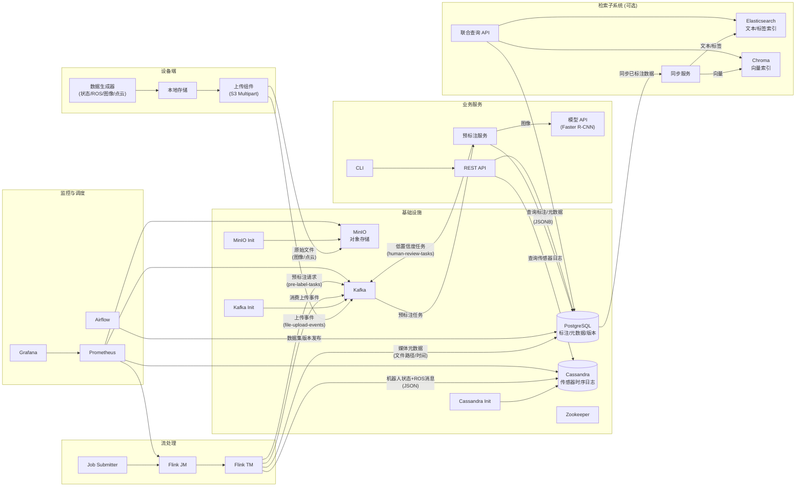
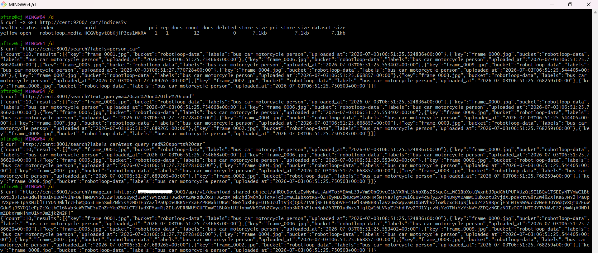
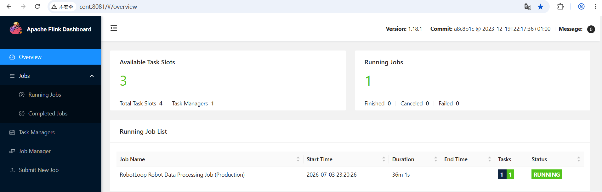
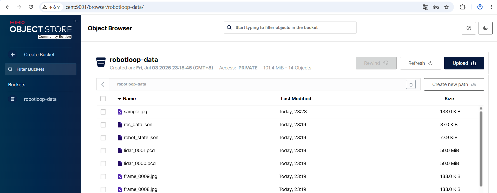
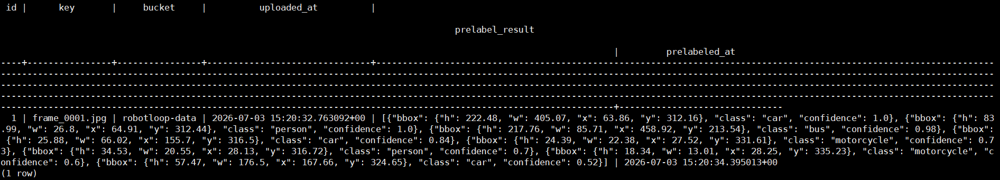
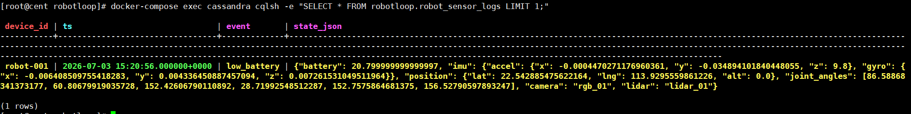
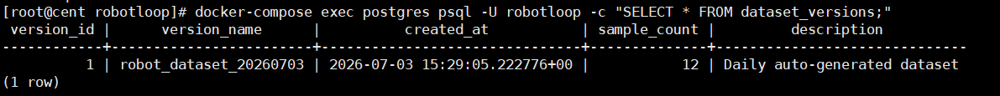
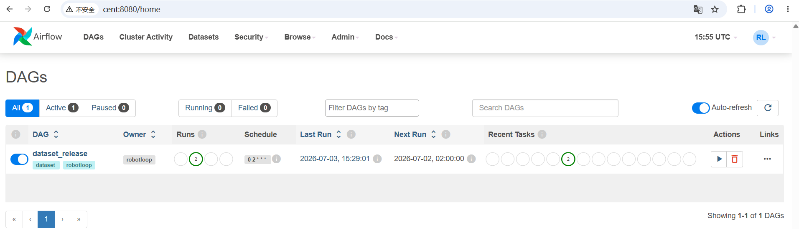

# RobotLoop — 机器人多模态数据闭环平台 Demo

RobotLoop 是一个面向 **机器人/无人系统** 的端到端数据闭环系统，并集成了 **多模态联合检索**
子系统。项目完整覆盖设备端数据生成、弱网断点续传、云端流处理、冷热存储、自动预标注、数据集版本管理、监控与检索的全链路。适用于自动驾驶、仓储
AGV、无人机、机械臂遥操作等场景。

本 Demo 涵盖：

- 设备端 → 云端的数据自动化上传管道（支持断点续传）
- 基于 Kafka + Flink 的实时流处理
- 多模态数据（机器人状态、ROS 消息、图像、LiDAR）的元数据管理与自动预标注
- 存储分层：Cassandra 存储高频传感器时序日志，PostgreSQL 存储标注结果与业务元数据，MinIO/S3 存储原始文件
- Airflow 数据管道调度与数据集版本管理
- REST API 与命令行工具链
- Prometheus + Grafana 全链路监控
- **多模态联合检索**：基于 Elasticsearch + Chroma 的跨引擎查询，支持标签、语义相似度等条件组合检索

## 架构图



> 架构说明：
> - **核心管道**：设备端模拟器生成多模态数据，通过断点续传上传至 MinIO，同时 Kafka 事件驱动 Flink 流处理，传感器日志写入
    Cassandra，媒体元数据写入 PostgreSQL，自动触发预标注（模型 API）。
> - **检索子系统（可选扩展）**：通过 `sync_to_retrieval.py` 将 PostgreSQL 中的预标注结果同步到 Elasticsearch（标签索引）和
    Chroma（向量索引），并对外提供联合查询 API。查询规划器接收复杂检索条件，分解为子查询分发到不同引擎，融合结果后返回。
> - **调度与监控**：Airflow 管理数据集版本发布，Prometheus + Grafana 监控全链路。

## 项目结构

```text
robotloop/
├── README.md
├── docker-compose.yml               # 核心服务（不含检索）
├── .env.example
├── Makefile
├── device/                          # 设备端模拟
│   ├── Dockerfile
│   ├── generator.py                 # 生成模拟机器人数据（ROS 消息、图像、点云）
│   ├── uploader.py                  # S3 断点续传上传 + Kafka 事件发送
│   ├── start.sh                     # 设备模拟器启动脚本
│   ├── sample.jpg                   # 预置的真实图片（用于模型检测）
│   └── requirements.txt
├── cloud/                           # 云端服务
│   ├── flink/                       # Flink 作业
│   │   ├── Dockerfile
│   │   ├── robot_stream_job.py      # 生产级 PyFlink 作业（消费 Kafka 并处理）
│   │   └── requirements.txt
│   ├── api/                         # REST API
│   │   ├── Dockerfile
│   │   ├── main.py
│   │   └── requirements.txt
│   ├── preprocessing/               # 预标注服务
│   │   ├── Dockerfile
│   │   ├── pre_label_service.py
│   │   └── requirements.txt
│   ├── model_api/                   # 轻量级模型推理 API
│   │   ├── Dockerfile
│   │   ├── model_api.py             # Faster R-CNN MobileNetV3
│   │   └── requirements.txt
│   └── storage/                     # 数据库初始化脚本
│       └── init-schema.sql
├── airflow/                         # Airflow 调度
│   ├── dags/
│   │   └── dataset_release.py       # 每日数据集质量检查与版本发布
│   ├── plugins/
│   └── requirements.txt
├── infra/                           # 基础设施配置
│   ├── kafka/
│   │   └── create-topics.sh
│   ├── prometheus/
│   │   └── prometheus.yml
│   ├── grafana/
│   │   └── dashboards/
│   │       └── skyLoop.json
│   └── minio-init/
│       └── init.sh
├── tools/                           # 开发者 CLI
│   ├── Dockerfile
│   ├── cli.py
│   └── requirements.txt
├── services/
│   └── retrieval/                   # 多模态检索子系统
│       ├── README.md
│       ├── docker-compose.yml       # 检索子系统入口
│       ├── Dockerfile
│       ├── sync_to_retrieval.py     # 从 PG 同步到 ES 和 Chroma 
│       ├── search_api.py            # 联合查询 API
│       └── requirements.txt
└── tests/                           # 测试（可选）
```

## 快速开始

### 1. 前置条件

- Docker & Docker Compose
- 至少 12 GB 可用内存（推荐 16 GB 以上，含检索模块建议 16 GB）

### 2. 启动核心闭环服务

```bash
cp .env.example .env
docker-compose up -d
```

等待所有容器启动（首次构建约 3~5 分钟，模型自动下载）。设备模拟器会自动生成示例数据并上传。

### 3. 启动多模态检索子系统（可选）

```bash
# 进入检索服务目录
cd services/retrieval
docker-compose up -d
# 执行数据同步（从 PostgreSQL 同步到 ES 和 Chroma ）
docker-compose run --rm sync python sync_to_retrieval.py
```

同步完成后，可通过 `http://localhost:8001/docs` 测试联合查询 API（示例：`/search?labels=person`）。

### 4. 查看各组件 Web UI

- Flink Dashboard: `http://localhost:8081`
- MinIO Console: `http://localhost:9001` (minioadmin / minioadmin)
- Airflow: `http://localhost:8080` (admin / admin)
- Grafana: `http://localhost:3000` (admin / admin)
- Elasticsearch: `http://localhost:9200`

## 模块说明

### 设备端（device-simulator）

- **generator.py**：生成模拟机器人状态日志 (`robot_state.json`)、ROS 话题消息 (`ros_data.json`)、图像（使用 `sample.jpg`
  复制）和 LiDAR 占位文件。
- **uploader.py**：S3 Multipart Upload 断点续传至 MinIO，上传完成后发送 Kafka 事件 `file-upload-events`。

### 云端流处理（Flink）

- 消费 `file-upload-events`。
- 解析机器人状态 JSON → 写入 Cassandra `robot_sensor_logs`。
- 解析 ROS 消息 → 提取 IMU/GPS/Image 写入 Cassandra。
- 媒体文件 → 写入 PostgreSQL `media_files` → 触发 `pre-label-tasks`。

### 模型推理 API（model-api）

- 基于 PyTorch + TorchVision 的 Faster R-CNN MobileNetV3-Large FPN 预训练模型。
- 提供 `POST /detect` 接口，返回检测框（类别、置信度、坐标），支持通过参数切换模型版本（可插拔设计）。

### 预标注服务（prelabel）

- 消费 `pre-label-tasks`，对图像调用模型 API 生成预标注结果。
- 结果写入 `media_files.prelabel_result`，低置信度检测自动推送到人工审核队列 (`human-review-tasks`)。

### REST API 服务

提供 FastAPI 接口：

- `GET /health`：健康检查
- `POST /export/sensor-logs`：从 Cassandra 导出传感器日志 CSV
- `POST /prelabel/trigger`：手动触发预标注任务
- `GET /files`：浏览 MinIO 文件列表
- `GET /metrics`：管线统计

### 开发者 CLI

```bash
docker-compose run --rm cli export-sensor-logs --start 2026-01-01
```

### 多模态检索子系统（可选扩展）

- **sync_to_retrieval.py**：读取 PostgreSQL 中已标注的媒体记录，提取类别标签并生成文本 Embedding，分别写入 Elasticsearch 和
  Chroma 。
- **search_api.py**：FastAPI 联合查询服务，接收标签、天气、文本描述或图像 URL，分解查询至 ES 和 Chroma ，融合结果并返回。

### Airflow

- DAG `dataset_release` 每日定时检查预标注完成率，并创建数据集版本记录 (`dataset_versions` 表)。

### 监控

- Prometheus (`:9090`) + Grafana (`:3000`)，预置 SkyLoop 面板。

## 端到端验证

### 1. 设备上传日志

```text
device-simulator-1  | 文件 robot_state.json 上传完成
device-simulator-1  | 文件 frame_0000.jpg 上传完成
device-simulator-1  | 已发送上传事件: frame_0000.jpg
```

### 2. Flink 作业处理

```text
flink-taskmanager-1  | Processing event: robot_state.json
flink-taskmanager-1  | Inserted 100 robot logs
flink-taskmanager-1  | Sent prelabel task for frame_0000.jpg
```

### 3. 模型 API 推理

```text
model-api-1  | INFO:model-api:Model v1 detected 8 objects
```

### 4. 预标注服务

```text
prelabel-1  | 收到任务: frame_0000.jpg
prelabel-1  | 推理完成，检测到 8 个目标
prelabel-1  | 人工审核任务已发送: frame_0000.jpg
```

### 5. Cassandra 传感器日志验证

```bash
docker-compose exec cassandra cqlsh -e "SELECT * FROM robotloop.robot_sensor_logs LIMIT 5;"
```

示例输出：

```text
 device_id | ts                              | event       | state_json
-----------+---------------------------------+-------------+-----------------------------------------
robot-001 | 2026-07-02 07:40:16.000000+0000 | low_battery | {"battery": 20.8, "imu": {...}, ...}
```

### 6. PostgreSQL 标注结果验证

```bash
docker-compose exec postgres psql -U robotloop -d robotloop -c "SELECT id, key, prelabel_result FROM media_files WHERE prelabel_result IS NOT NULL;"
```

示例输出：

```text
 id |      key       | prelabel_result
----+----------------+------------------
  1 | frame_0001.jpg | [{"class": "car", "confidence": 1.0, "bbox": {"x": 63.86, "y": 312.16, "w": 405.07, "h": 222.48}}, {"class": "person", "confidence": 1.0, "bbox": {"x": 64.91, "y": 312.44, "w": 26.8, "h": 83.99}}, {"class": "bus", "confidence": 0.98, "bbox": {"x": 458.92, "y": 213.54, "w": 85.71, "h": 217.76}}, {"class": "car", "confidence": 0.84, "bbox": {"x": 155.7, "y": 316.5, "w": 66.02, "h": 25.88}}, {"class": "motorcycle", "confidence": 0.73, "bbox": {"x": 27.52, "y": 331.61, "w": 22.38, "h": 24.39}}, {"class": "person", "confidence": 0.7, "bbox": {"x": 28.13, "y": 316.72, "w": 20.55, "h": 34.53}}, {"class": "motorcycle", "confidence": 0.6, "bbox": {"x": 28.25, "y": 335.23, "w": 13.01, "h": 18.34}}, {"class": "car", "confidence": 0.52, "bbox": {"x": 167.66, "y": 324.65, "w": 176.5, "h": 57.47}}]
```

### 7. Airflow 数据集版本

```bash
docker-compose exec postgres psql -U robotloop -d robotloop -c "SELECT * FROM dataset_versions;"
```

预期输出一条每日版本记录，包含样本数量。

### 8. 多模态检索验证

```bash
# 纯标签检索
curl "http://localhost:8001/search?labels=person"

# 多标签联合检索
curl "http://localhost:8001/search?labels=person,car"

# 文本语义检索
curl "http://localhost:8001/search?text_query=a%20car%20on%20the%20road"

# 组合检索（标签 + 文本）
curl "http://localhost:8001/search?labels=car&text_query=red%20sports%20car"

# 以图搜图（需可访问的图片 URL）
curl "http://localhost:8001/search?image_url=https://images.unsplash.com/photo-1517849845537-4d257902454a?w=300"
```

示例返回（组合检索）：

```json
{
  "count": 2,
  "results": [
    {
      "key": "frame_0001.jpg",
      "bucket": "robotloop-data",
      "labels": "car person",
      "uploaded_at": "2026-07-02T07:40:16"
    }
  ]
}
```



### 9. 系统运行截图

以下为各核心环节的实际运行截图，可与上述日志验证对照。

| 组件              | 截图                                                   |
|-----------------|------------------------------------------------------|
| Flink 作业运行状态    |                    |
| MinIO 存储桶文件列表   |                       |
| PostgreSQL 标注结果 |              |
| Cassandra 传感器日志 |  |
| Airflow 数据集版本   |    |
| Airflow Web UI  |                |

## 环境变量

复制 `.env.example` 为 `.env` 可按需修改：

- `S3_ENDPOINT` / `S3_BUCKET`：MinIO 连接配置
- `PG_HOST` / `PG_USER` / `PG_PASSWORD` / `PG_DB`：PostgreSQL 连接配置（默认均为 `robotloop`）
- `KAFKA_BOOTSTRAP`：Kafka 地址
- `MODEL_API_URL`：模型 API 地址（默认 `http://model-api:9002`）
- `SIMULATE_NETWORK_ISSUES`：设为 `true` 开启网络中断模拟

## 开发说明

- **代码挂载**：`api`、`prelabel`、`device-simulator` 等服务均挂载了宿主机目录，修改代码后无需重新构建镜像，直接重启容器即可生效（api
  支持热重载）。
- **添加依赖**：修改对应模块的 `requirements.txt` 后执行 `docker-compose build --no-cache <service>`。
- **清空所有数据重新开始**：`docker-compose down -v`。
- **模型缓存**：模型 API 首次启动时会自动下载预训练权重（约 50MB），建议保持网络通畅。可挂载 `~/.cache/torch` 目录避免重复下载。

## 技术栈

- **语言**：Python 3.10
- **流处理**：Apache Flink 1.18（PyFlink）
- **消息队列**：Kafka (Confluent 7.5)
- **存储**：MinIO (S3 兼容)、PostgreSQL 15、Cassandra 4.1
- **调度**：Apache Airflow 2.9.2（CeleryExecutor）
- **模型推理**：PyTorch + TorchVision (Faster R-CNN MobileNetV3)
- **检索**：Elasticsearch 8.x, Chroma 2.3, Sentence-Transformers
- **监控**：Prometheus + Grafana
- **容器化**：Docker, Docker Compose

## 作者

RobotLoop 数据平台团队 – Demo 演示版本  
GitHub: [https://github.com/pftn/robotloop](https://github.com/pftn/robotloop)