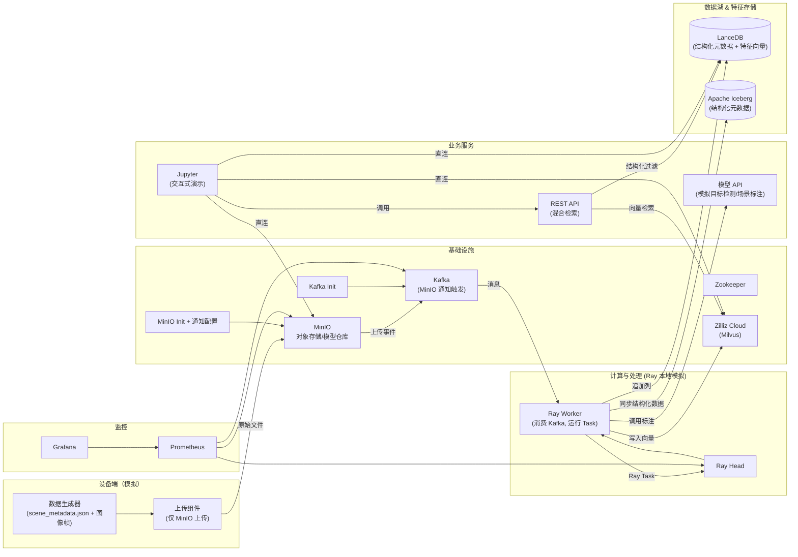

# RobotLoop — 机器人多模态数据闭环平台（技术验证原型）

RobotLoop 是一个面向 **具身智能/机器人** 的数据飞轮系统技术验证原型，集成 **混合语义检索** 与 **列式特征存储**。项目覆盖设备端模拟数据生成、对象存储事件驱动、Ray 统一调度、文本向量化、Lance 列式数据湖、Zilliz Cloud 向量库以及检索 API，形成从数据采集到特征存储的闭环验证。

## 本 Demo 展示

- **设备端模拟生成**多模态场景元数据（位姿、IMU、图像路径、ROS Bag 引用）
- **MinIO 对象存储**自动触发 Kafka 事件，驱动 Ray 数据处理流水线
- **Ray Core** 实现元数据下载、HTTP 标注、CLIP 文本向量化、模拟轨迹编码
- **LanceDB** 列式追加写入（结构化元数据 + 特征向量）
- **Zilliz Cloud** 存储文本向量并提供语义检索
- **Iceberg** 同步结构化元数据（企业数仓/BI 兼容）
- **混合检索 API**：结构化条件（场景类型、质量分）+ 语义向量
- **Jupyter** 交互式演示环境
- **Prometheus + Grafana** 监控链路

> **注意**：本原型在单台 64GB PC 上运行，部分高级功能（GPU 视频解码、SAM 语义分割、VLM 场景描述、图像 CLIP 编码、PointNet 点云处理）为架构设计目标，当前版本使用模拟数据或 HTTP Mock 验证链路。

## 架构图



> **架构说明**：
> - **设备端**：生成 `scene_metadata.json`（包含场景描述、类型、质量分等）及模拟图像帧，上传至 MinIO；不直接依赖 Kafka。
> - **事件驱动**：MinIO 通过 Bucket 通知将 `put` 事件推送至 Kafka `raw-data-ingest`。
> - **计算层**：Ray Worker（本地单节点模拟）消费 Kafka 事件，执行 Download → Annotate → Embedding → WriteOut Task，写入 Lance、Zilliz Cloud、Iceberg。
> - **存储**：LanceDB 存储结构化元数据 + 特征向量；Iceberg 同步结构化元数据；Zilliz Cloud 提供向量检索。
> - **检索**：REST API 接收结构化条件 + 语义向量，查询 Zilliz Cloud 获得候选 ID，再通过 Lance 精确过滤排序。
> - **演示**：Jupyter 容器可直接访问内部服务，运行 Notebook 体验数据浏览、混合搜索。
> - **模型管理**：CLIP 模型权重通过 MinIO 版本化管理，Ray Worker 启动时下载并缓存。

## 项目结构

```text
robotloop/
├── README.md                        # 项目说明
├── Makefile                         # 构建脚本
├── docker-compose.yml               # 核心服务编排
├── .env.example                     # 环境变量模板
├── device/                          # 设备端模拟
│   ├── Dockerfile
│   ├── generator.py                 # 生成多模态场景元数据及图像帧
│   ├── uploader.py                  # 上传文件至 MinIO
│   ├── start.sh                     # 启动脚本
│   ├── sample.jpg                   # 样本图像
│   └── requirements.txt
├── cloud/                           # 云端服务
│   ├── ray_worker/                  # Ray 数据处理
│   │   ├── Dockerfile
│   │   ├── entrypoint.sh            # Worker 启动脚本
│   │   ├── ray_pipeline.py          # Ray Task：消费 Kafka, 处理场景, 写入存储
│   │   └── requirements.txt
│   ├── api/                         # 混合检索 REST API
│   │   ├── Dockerfile
│   │   ├── main.py                  # FastAPI，Zilliz Cloud + Lance 检索
│   │   └── requirements.txt
│   └── model_api/                   # 模型推理服务（模拟）
│       ├── Dockerfile
│       ├── Dockerfile.model-init      # 模型初始化镜像
│       ├── model_api.py             # 模拟目标检测 + 场景标注
│       ├── init_model.py            # 下载模型并上传至 MinIO
│       └── requirements.txt
├── jupyter/                         # 交互式演示
│   ├── Dockerfile
│   ├── demo.ipynb                   # 全流程演示 Notebook
│   └── requirements.txt
├── infra/                           # 基础设施配置
│   ├── prometheus/
│   │   └── prometheus.yml
│   └── grafana/
│       └── dashboards/
│           └── robotLoop.json
└── tests/                           # 测试（预留）
```

## 快速开始

### 1. 前置条件

- Docker & Docker Compose (v2.0+)
- 至少 8 GB 可用内存（推荐 16 GB）
- Zilliz Cloud 账号（免费试用即可），获取 `MILVUS_URI` 和 `MILVUS_TOKEN`

### 2. 配置环境变量

```bash
cp .env.example .env
# 编辑 .env，修改 MILVUS_URI 和 MILVUS_TOKEN
```

### 3. 启动所有服务

```bash
docker compose up -d
```

首次启动会自动：
- 初始化 Kafka topics
- 创建 MinIO buckets（robotloop-data, models, iceberg-warehouse）并配置 Kafka 通知
- 下载模型权重并上传至 MinIO（`model-init`）
- 启动 Ray 集群、模型 API、检索 API、设备模拟器
- 设备模拟器生成 1000 条场景数据并上传至 MinIO

等待所有容器健康运行（约 2-3 分钟）：
```bash
docker compose ps
```

### 4. 触发数据处理流水线

设备模拟器上传文件后，MinIO 自动发送事件到 Kafka，Ray Worker 自动消费并执行处理 Task，将结果写入 Lance、Zilliz Cloud、Iceberg。

检查 Ray Worker 日志：
```bash
docker compose logs -f ray-worker
```

### 5. 访问各组件

- Ray Dashboard: `http://localhost:8265`
- MinIO Console: `http://localhost:9001` (minioadmin / minioadmin)
- Jupyter Notebook: `http://localhost:8888` (无密码)
- API 文档 (Swagger): `http://localhost:8000/docs`
- Prometheus: `http://localhost:9090`
- Grafana: `http://localhost:3000` (admin / admin)

### 6. Jupyter 演示

打开 `http://localhost:8888`，进入 `work` 目录，打开 `demo.ipynb` 体验全流程。

## 模块说明

### 设备端模拟器（device）

- **generator.py**：生成 `scene_metadata.json`（包含 1000 个场景的结构化元数据）和多个模拟图像帧（复制 sample.jpg），存储在 `/tmp/robot_data`。
- **uploader.py**：将 `/tmp/robot_data` 下所有文件上传至 MinIO `robotloop-data` bucket，**不依赖 Kafka**。上传完成后 MinIO 自动发送事件。

### Ray 数据处理服务（ray_worker）

- 消费 Kafka `raw-data-ingest` 主题。
- 检测到 `data/scene_metadata.json` 文件时，启动处理流水线：
  1. 从 MinIO 下载元数据
  2. 并行调用模型 API 进行场景标注（获取描述、质量分）
  3. 使用 CLIP 模型生成 512 维文本语义向量
  4. 生成模拟 256 维轨迹向量（可替换为真实轨迹编码器）
  5. 批量追加写入 LanceDB
  6. 批量插入 Zilliz Cloud 向量集合
  7. 同步结构化数据到 Iceberg

### 模型 API（model_api）

- 启动时从 MinIO `models` bucket 下载预训练权重（Faster R-CNN MobileNetV3），缓存到本地 `/models`。
- `POST /detect`：目标检测（COCO 80 类），返回边界框、置信度、类别。
- `POST /annotate`：模拟场景标注，返回随机场景描述、mask embedding（256维）和质量评分。

> **注意**：当前版本为模拟实现，用于验证数据链路。生产环境可替换为真实的 SAM/VLM 服务。

### 混合检索 API（api）

- `POST /search`：支持结构化过滤（`scene_type`、`quality_min`）和向量检索（`text_query` 语义向量）。
- 内部流程：先通过 Zilliz Cloud 向量相似搜索获取候选 `scene_id`，再在 Lance 中应用结构化过滤并排序。

### Jupyter 交互环境

- 基于 `jupyter/scipy-notebook`，预装 `boto3`、`pymilvus`、`sentence-transformers`、`lancedb` 等。
- 可直接连接内网 MinIO、Zilliz Cloud、API 服务，快速原型验证。

### 监控（Prometheus + Grafana）

- Prometheus 采集 Ray Head、MinIO、Kafka 的指标。
- Grafana 预置 RobotLoop 面板，展示处理吞吐、存储用量等。

## 环境变量

复制 `.env.example` 为 `.env`，主要变量说明：

| 变量 | 说明 | 默认值 |
|------|------|--------|
| `S3_ENDPOINT` | MinIO 端点 | `http://minio:9000` |
| `S3_BUCKET` | 数据 bucket | `robotloop-data` |
| `S3_ACCESS_KEY` | MinIO access key | `minioadmin` |
| `S3_SECRET_KEY` | MinIO secret key | `minioadmin` |
| `MILVUS_URI` | Zilliz Cloud 连接地址 | - |
| `MILVUS_TOKEN` | Zilliz Cloud API Key | - |
| `KAFKA_BOOTSTRAP` | Kafka 地址 | `kafka:9092` |
| `MODEL_API_URL` | 模型 API 地址 | `http://model-api:9002` |
| `LANCE_PATH` | Lance 数据集路径 | `/tmp/lance` |
| `ICEBERG_WAREHOUSE` | Iceberg warehouse 路径 | `s3://iceberg-warehouse` |
| `ICEBERG_TABLE` | Iceberg 表名 | `robotloop.scenes_meta` |
| `ICEBERG_CATALOG_URI` | Iceberg REST catalog | `http://iceberg-rest:8181` |

## 开发说明

- **代码挂载**：`api`、`device`、`jupyter` 等服务挂载了宿主机目录，修改代码后无需重新构建镜像，直接重启容器即可生效。
- **添加依赖**：修改对应模块的 `requirements.txt` 后执行 `docker compose build --no-cache <service>`。
- **清空所有数据重新开始**：`docker compose down -v`。
- **模型缓存**：模型 API 首次启动时会从 MinIO 下载权重到本地卷，后续重启无需再次下载。
- **Iceberg 独立 bucket**：Iceberg 数据存储在独立的 `iceberg-warehouse` bucket，避免触发 Kafka 通知循环。

## 技术栈

- **语言**：Python 3.10
- **流处理**：Apache Kafka (Confluent 7.5)
- **计算引擎**：Ray 2.9（本地模拟分布式）
- **存储**：MinIO (S3 兼容)、LanceDB (列式数据湖)、Zilliz Cloud (全托管 Milvus)、Apache Iceberg (结构化数仓)
- **模型推理**：PyTorch + TorchVision (Faster R-CNN MobileNetV3)，支持 MinIO 模型仓库
- **监控**：Prometheus + Grafana
- **容器化**：Docker, Docker Compose

## 已知限制与扩展方向

- **图像/视频处理**：当前版本仅生成模拟图像帧，未实现 NVENC 视频解码、SAM 语义分割、图像 CLIP 编码。生产环境可扩展 GPU Worker 节点处理。
- **点云处理**：ROS Bag 解析和 PointNet 点云去噪为设计目标，当前版本使用模拟数据占位。
- **轨迹编码**：使用随机向量模拟，生产环境可替换为真实轨迹编码器（如 TCN、Transformer）。
- **VLM 场景描述**：当前为 HTTP Mock 服务，生产环境可集成真实的 Qwen-VL、LLaVA 等模型。

## 作者

RobotLoop 数据平台团队 – 技术验证原型
GitHub: [https://github.com/pftn/robotloop](https://github.com/pftn/robotloop)
