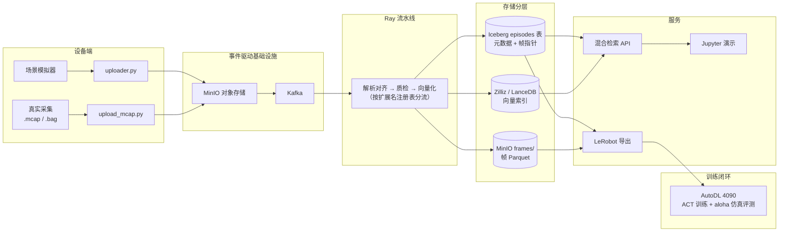
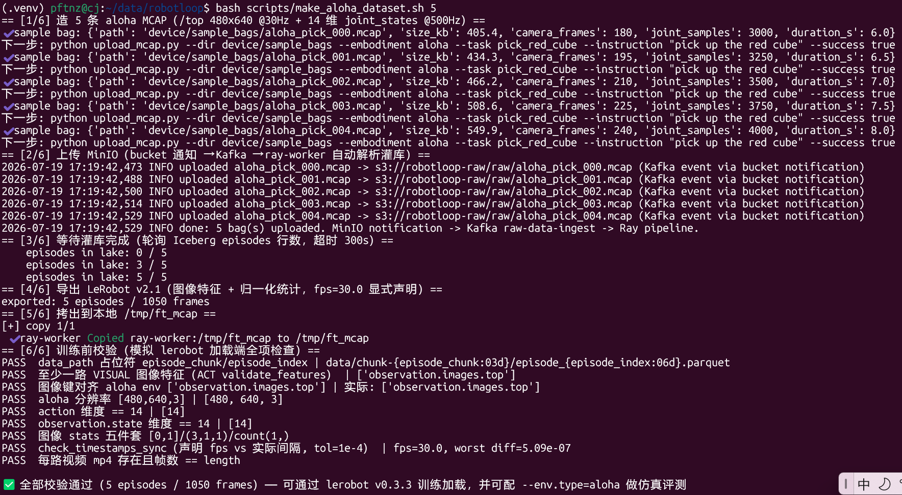
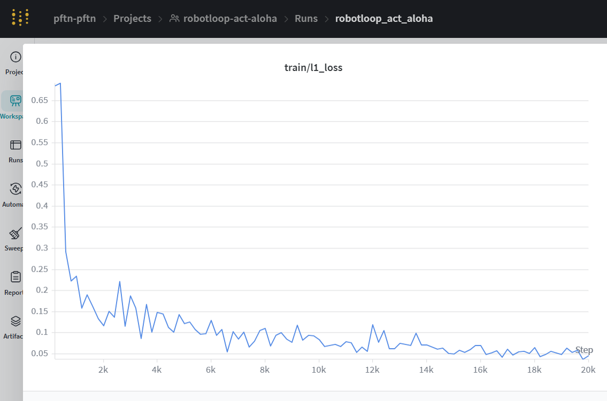

# RobotLoop — 具身智能数据闭环平台

从设备数据（MCAP/rosbag2）进来，到 LeRobot 训练格式出去——中间是统一数据模型、
数据湖、混合检索与质检的一条完整链路。

> 📹 **自采 MCAP → 数据湖 → 导出 → ACT 训练 → aloha 仿真评测**，全链路实测录屏：
> [docs/assets/eval_aloha.mp4](docs/assets/eval_aloha.mp4)（20K 步训练的 policy 在
> gym_aloha 仿真中执行 rollout；数字见[训练闭环](#训练闭环autodl-4090)一节）

## 为什么做

具身数据链路是断的：采集侧是 ROS bag，训练侧要 LeRobot/RLDS，中间缺少统一的
数据模型和基础设施。LeRobot 生态 v2.1/v3.0 双版本并存、下游框架各自站队，
格式转换是真实痛点。而数据质量决定模型上限，"出厂检验"在开源生态里几乎没人做。

## 架构



## 核心能力

- **统一 Episode 数据模型** —— 轨迹级元数据进 Iceberg，帧数据按 LeRobot v3
  文件块思路落 Parquet，检索、过滤、训练导出共用同一模型
- **真实数据入口** —— MCAP/rosbag2 解析（纯 Python，零 ROS 依赖），
  相机帧锚点 + 关节流多速率时间戳对齐，对齐质量出报告
- **混合检索** —— CLIP 语义向量 × Iceberg 结构化过滤联合命中：
  「ALOHA 双臂成功抓取红色方块的相似轨迹」一条 query 同时用上两侧
- **数据质检流水线** —— 失败轨迹过滤 / 频率异常检测 / 相似度去重 /
  任务分布统计，接入 Ray 流水线在入库前自动执行，剔除原因可解释
- **lerobot-convert** —— LeRobot v2.1 ↔ v3.0 批量互转 + 校验的独立工具库，
  `pip install` 即用（[lerobot-convert/](lerobot-convert/)）
- **训练闭环** —— 按条件从数据湖导出 LeRobot 格式（图像特征 + 归一化统计
  齐备，训练前一键校验），AutoDL 4090 上 ACT 训练 + aloha 仿真评测

## RLDS ↔ LeRobot ↔ RobotLoop 概念映射

三套生态用三套词汇描述同一件事。Episode/Step 模型是它们的公共超集
（`is_first/is_last/is_terminal`、`language_instruction` 字段命名对齐）——
这张表是理解整个领域模型的钥匙：

| 概念 | RLDS（TFDS/Open X） | LeRobot（HF） | RobotLoop | 备注 |
|---|---|---|---|---|
| 数据集 | TFDS DatasetBuilder | LeRobotDataset（HF repo） | Iceberg namespace + MinIO frames/ | `episodes.dataset_name` 记录来源 |
| 一条轨迹 | Episode | 一个 episode | `episodes` 表一行 | 主键 `episode_id` |
| 一帧 | Step | 一帧（data 一行） | `frames/{episode_id}.parquet` 中一行 | `frame_index` 三边一致 |
| 任务/语言指令 | `language_instruction` | `meta/tasks` + 帧级 `task_index` | `episodes.task` + `language_instruction` | 文本是 CLIP 语义检索的编码对象 |
| 观测 | `observation`（嵌套 dict） | `observation.state` / `observation.images.*` | 帧 parquet 的 `state` + `image_paths` | 图像落对象存储，只存路径 |
| 动作 | `action` | `action` 列 | 帧 parquet `action`（list\<double\>） | 维度语义放 modality.json 元数据，不写死 schema |
| 奖励 | `reward` | 无标准字段 | 帧 parquet `reward`（可空） | LeRobot 面向模仿学习 |
| 终止标记 | `is_terminal` / `is_last` / `is_first` | episode 边界 + frame_index | 帧 parquet 三者齐全（超集） | 导出时按边界推导 |
| 成功标记 | 无标准 | 无标准 | `episodes.success`（bool，可空） | 失败过滤的第一字段 |
| 机器人本体 | 隐含在元信息 | `info.json` 的 `robot_type` | `episodes.embodiment_tag` + `robot_type` | 与 GR00T embodiment tag / Open X 命名对齐 |
| 采集来源 | 无 | 无 | `episodes.source`（teleop \| sim \| real） | 区分遥操作/仿真/真机自主 |
| 时间基准 | step 序号 | `timestamp` 列 | 帧 parquet `timestamp`（对齐后统一时刻） | 多 topic 原始时间戳入库前对齐 |
| 格式版本 | TFDS version | `codebase_version`（v2.1 / v3.0） | —（convert 层双版本兼容） | π0/OpenPI 要 v2.1；新工具链要 v3.0 |

## 设计决策

- **存储分层：元数据与帧数据分离。** 帧数据一 episode 一 Parquet（对齐
  LeRobot v3 文件块设计），Iceberg 仅存元数据与指针，避免小文件问题，
  Parquet row group 天然支持帧级随机读。
- **解析层零 ROS 依赖。** 基于 `rosbags` 纯 Python 实现，云端 / CI /
  客户环境部署无需 ROS2 运行时。
- **范围决策：Open X（RLDS）支持单向导入**，导出聚焦 LeRobot 生态
  （事实标准，覆盖 π0/GR00T 训练链路）。
- **闭环验证双轨：自采 aloha 全链路为主，ACT × PushT 为回归验证基线。**
  自采 14 维 MCAP 与 gym_aloha 观测空间天然对齐（/top、480×640），
  训练后可做仿真评测；PushT 低成本、小时级可复现，用于管线回归。
  GR00T/OpenVLA 接入已预留 modality.json 生成与脚本模板
  （见 `robotloop/export/gr00t.py`）。

## 快速开始

```bash
cp .env.example .env          # 填入 MILVUS_URI / MILVUS_TOKEN（Zilliz 免费版）
docker compose up -d          # MinIO / Kafka / Ray / Iceberg REST / API / Grafana
```

启动后 device-simulator 自动完成全链路：生成示例 MCAP 包（合成 30Hz 相机 +
500Hz 关节流，8 秒 pick 轨迹）→ 上传到原始数据 bucket `robotloop-raw` →
bucket notification 发 Kafka → Ray 按扩展名分流解析入库。直接看日志：

```bash
docker compose logs -f ray-worker   # 解析→质检→向量化→写库
```

真实采集的 `.mcap` 放到 `device/sample_bags/` 后手动触发一次即可：
`docker compose exec device-simulator python /app/upload_mcap.py --dir /app/sample_bags --embodiment <本体> --task <任务> --instruction "<指令>" --source teleop --success true`

本地开发（无 Docker）：

```bash
pip install -r requirements-pipeline.txt
pytest tests/ -q                                    # 76 个用例
robotloop ingest-demo --store ./lake -n 60          # 合成数据灌库
robotloop search --store ./lake --query "找所有 ALOHA 双臂成功抓取红色方块的轨迹"
robotloop export --store ./lake --out ./ft_data --version v2.1 \
  --filters '{"embodiment_tag": "aloha", "source": "sim"}' --fps 10.0
robotloop finetune-script --dataset ./ft_data --env aloha --out ./run_act.sh
```

公开数据集灌库（数据集清单 / size preflight / 验收）：[docs/datasets.md](docs/datasets.md)。

## 训练闭环（AutoDL 4090）

自采 MCAP → 平台灌库 → 检索过滤 → 导出 → ACT 训练 + aloha 仿真评测，
**全链路已在 AutoDL 4090 上实测完成**。

**一条龙脚本**（造包 → 上传 → 等灌库 → 导出 → 拷出 → 训练前校验）：

```bash
bash scripts/make_aloha_dataset.sh 5     # 5 条 aloha 包：/top 480x640 + 14 维
```



**训练前校验**——模拟 lerobot v0.3.3 加载端全项检查（占位符 / ACT 图像
特征 / stats 五件套 / 时间戳容差 / 帧数一致 / env 键名对齐），
校验不通过则不进入训练阶段：

```bash
python3 scripts/verify_lerobot_dataset.py ./ft_mcap --expect-env aloha
```

上卡训练（`run_act.sh` 由 `robotloop finetune-script` 生成）：

```bash
scp -r ./ft_mcap root@<AutoDL-IP>:/root/lerobot/data/ft_mcap
DATASET=/root/lerobot/data/ft_mcap bash run_act.sh
```

### 实测结果（5 episodes / 1050 frames，20K 步，42 分钟）

| 指标 | 数值 |
|---|---|
| 训练 loss（加权） | 5.54 → 0.06（20K 步） |
| l1_loss（wandb） | 0.68 → 0.05 |
| 梯度范数 | 142 → 9.4 |
| 仿真评测 | 4 个节点（5K/10K/15K/20K）各 rollout 一次，录屏见 [docs/assets/eval_aloha.mp4](docs/assets/eval_aloha.mp4) |
| 评测成功率 | 0% —— 预期结果：5 条数据 152 个 epoch 属重度过拟合，且训练任务（pick_red_cube）与评测任务（AlohaInsertion-v0）语义不同；该结果验证的是**评测管线可运行**，策略性能需更大数据规模 |



完整训练日志：[docs/assets/train_aloha.log](docs/assets/train_aloha.log)。

**env 对齐规则**（错配将在训练或评测阶段报错，均为实测案例）：

| 训练数据 | `--env.type` | 说明 |
|---|---|---|
| 自采 14 维（aloha） | `aloha` 或 `''` | 相机键/分辨率已对齐 gym_aloha（`observation.images.top`, 480×640），可仿真评测；`''` 只训练不评测 |
| pusht 2 维 | `pusht` | 官方数据回归验证链路（环境基线） |

两个运维注意：① episode_id 随机生成，**重灌同批包前请先清理旧 episode**
（`scripts/make_aloha_dataset.sh` 末尾附清理命令）；② 导出应按单一
本体+来源过滤（混维度/混帧率会被导出端一致性检查拦截，报错信息中含过滤建议）。

## 实测数据

以下数字均在仓库当前代码上实际跑出（运行环境见各出处）：

| 项目 | 结果 | 出处 |
|---|---|---|
| 单元测试 | 76 个用例全部通过（对齐/转换/质检/检索/导出/lerobot-convert） | `pytest tests/ -q` |
| lerobot-convert 往返 | v2.1 → v3.0 → v2.1：24 episodes / 647 frames，帧数据逐值一致 | `tests/test_lerobot_convert_lib.py` |
| 灌库吞吐（本地镜像后端） | 60 episodes / 1673 steps，0.29s | `scripts/ingest_public_datasets.py --demo` |
| 混合检索端到端 | 语义×结构化联合命中、消融对比（仅语义召回 3/5 失败轨迹 → 混合 0/5） | `jupyter/hybrid_search_demo.ipynb`（含实际执行输出） |
| 训练数据集端到端 | MCAP→灌库→导出→lerobot 加载端全项校验通过（worst diff 5.09e-07，容差 1e-4） | `scripts/verify_lerobot_dataset.py` |
| AutoDL 训练全链路 | 5 episodes / 1050 frames 自采数据，ACT 20K 步 42 分钟训完，loss 5.54 → 0.06，4 个 eval 节点仿真评测 + 录屏正常产出 | [训练日志](docs/assets/train_aloha.log) / [评测录屏](docs/assets/eval_aloha.mp4) |

检索延迟等 CI 环境（HashEncoder 降级模式）数字见
[docs/hybrid_retrieval.md](docs/hybrid_retrieval.md)；生产模式
（CLIP + Milvus + Iceberg REST）的端到端数字见 Roadmap。

## Reproducibility

本文所有数字可通过 `pytest tests/ -q` 与 `jupyter/hybrid_search_demo.ipynb`
复现。notebook 内的输出为实际执行结果，非手工填写。

## Roadmap

- **生产集群端到端数字** —— CLIP + Milvus + Iceberg REST 全链路的检索延迟/吞吐
- **Open X 真实子集灌库** —— TFDS 依赖独立 Docker 隔离（不污染主环境）
- **更大规模自采数据训练** —— 当前为 5 条 1050 帧的链路验证规模；
  扩大数据量后更新评测成功率数字

## 作者

个人独立项目（裸辞期间全职开发）。

GitHub: [@pftn](https://github.com/pftn) ｜ 技术博客: [@pftn](https://www.zhihu.com/people/pftn)

## License

[MIT](LICENSE)
