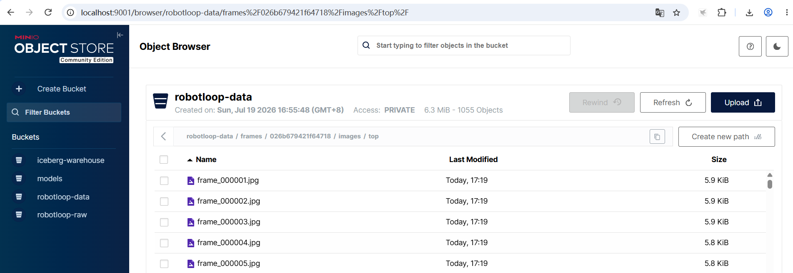
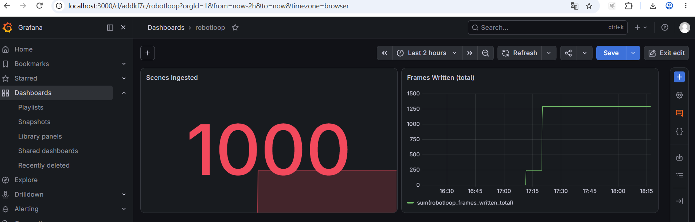

# 训练闭环

**全链路**：入库 → 检索 → 导出 → 训练 → 评测 → 视频

```
Iceberg 筛 episode ──► LeRobot v2.1 ──► AutoDL 4090 ──► aloha 仿真评测 + 录屏
（embodiment/source 过滤）  （图像特征+stats 齐备）  （ACT，<¥100）
```

主推**自采 aloha 全链路**：14 维 MCAP 与 gym_aloha 观测空间天然对齐
（`/top`、480×640），训练后可做仿真评测。ACT × PushT 保留为低成本
回归验证链路（管线改动后快速验证训练流程，<¥10）。

## 实测结果（AutoDL 4090，已完成）

5 条自采 MCAP（1050 帧）→ 平台灌库 → 导出 → ACT 训练 20K 步：

| 指标 | 数值 |
|---|---|
| 训练时长 | 42 分钟（20K 步，updt ≈ 0.076s/步） |
| 训练 loss（加权） | 5.54 → 0.06 |
| l1_loss（wandb） | 0.68 → 0.05 |
| 梯度范数 | 142 → 9.4 |
| 仿真评测 | 4 个节点（5K/10K/15K/20K），每次 rollout 约 55s，录屏正常产出 |
| 评测成功率 | 0% —— 预期结果：5 条数据 152 epoch 属重度过拟合，且训练任务与评测任务（AlohaInsertion-v0）语义不同；该结果验证评测管线可运行，策略性能需更大数据规模 |


评测录屏：[assets/eval_aloha.mp4](assets/eval_aloha.mp4)；
完整训练日志：[assets/train_aloha.log](assets/train_aloha.log)。

## 为什么用 ACT 而不是 GR00T/OpenVLA

| 方案 | 模型规模 | 4090 上可行性 | 成本 | 出结果时间 |
|---|---|---|---|---|
| **ACT（主推）** | ~52M | 轻松 | <¥100 | 2-3 小时 |
| Diffusion Policy | ~150M | 轻松 | <¥100 | 数小时 |
| GR00T N1.5 微调 | 3B | 勉强（24G 要关部分模块） | 数百元+ | 1-2 天调试 |
| OpenVLA 微调 | 7B | 不可行（需多卡/量化） | 失控 | 失控 |

演示闭环的目的是证明"数据平台 → 训练"这条路通，ACT 足够且可控。
架构上支持 GR00T/OpenVLA 微调接入（`robotloop.export.gr00t` 的
modality.json 生成与脚本模板已预留），**留作进阶**。

## 操作步骤（自采 aloha，已实测）

### 1. 一条龙：造包 → 灌库 → 导出 → 校验

```bash
bash scripts/make_aloha_dataset.sh 5     # 造 5 条包（/top 480x640@30Hz + 14 维@500Hz）
```

脚本六步：造包（先清旧包目录）→ 上传 MinIO（`--source sim --success true`）
→ 轮询等灌库 → 容器内导出（`--fps 30.0` 显式声明）→ 拷出 `./ft_mcap` →
自动跑训练前校验。实际执行输出：


入库时帧图像自动持久化到 MinIO（`s3://robotloop-data/frames/{episode_id}/images/top/`），
导出侧跨环境可读：



> ⚠️ episode_id 随机生成，**重灌同批包前请先清理旧 episode**（脚本末尾附
> 清理命令），否则重复数据会混进导出。

### 2. 训练前校验（任何导出产物都可单独跑）

模拟 lerobot v0.3.3 加载端全项检查，**校验不通过则不进入训练阶段**：

```bash
python3 scripts/verify_lerobot_dataset.py ./ft_mcap --expect-env aloha
```

覆盖项：`episode_chunk` 占位符 / ACT 图像特征（`validate_features`）/
图像 stats 五件套（`make_dataset`）/ 时间戳容差 1e-4（`check_timestamps_sync`）
/ mp4 帧数一致 / env 相机键名与分辨率对齐。

### 3. AutoDL 训练

```bash
scp -r ./ft_mcap root@<autodl-host>:/root/lerobot/data/ft_mcap
# run_act.sh 由 robotloop finetune-script 生成（--env.type=aloha）
robotloop finetune-script --dataset /root/lerobot/data/ft_mcap --env aloha --out /tmp/run_act.sh
scp run_act.sh root@<autodl-host>:/root/
nohup bash run_act.sh > train.log 2>&1 &
```

脚本要点：lerobot pin v0.3.3（main 分支训练入口已改 `lerobot-train`，
`lerobot.scripts.train` 模块路径不存在）→ `--push_to_hub=false` →
ffmpeg + torchcodec 版本对齐 → EGL 离屏渲染（eval 录屏用）→
每个 eval_freq 节点自动仿真评测，录屏落 `outputs/act_aloha/videos/`。

### 4. 回收证据

取一条 eval 录屏放回 README 顶部 —— 这是整个项目最有说服力的一张图。

## env 对齐规则（错配将在训练或评测阶段报错，均为实测案例）

| 训练数据 | `--env.type` | 说明 |
|---|---|---|
| 自采 14 维（aloha） | `aloha` 或 `''` | 相机键/分辨率已对齐 gym_aloha（`observation.images.top`, 480×640），可仿真评测；`''` 只训练不评测 |
| pusht 2 维 | `pusht` | 官方数据回归验证链路 |

两类实测错配报错：维度不符（14 vs 2）在 `normalize_inputs` 阶段抛出；
相机键名不符（`cam_image` vs `top`）在 eval 的 `predict_action_chunk` 阶段抛出。
真实机器人数据若 topic/分辨率不同，导出时用 `--camera-map` / `--video-size`
对齐（见 `robotloop export --help`）。

## 导出侧两个一致性拦截（设计行为，非缺陷）

- **混维度**：filters 未锁定本体时 7 维与 14 维混导 → `check_consistent_dims` 拦截
- **混帧率**：10Hz 与 30Hz 混导 → `check_consistent_fps` 拦截（lerobot 按单一
  fps 校验时间戳，混帧率数据无法通过加载校验）

报错信息中带过滤建议（如 `filters={"embodiment_tag": "aloha", "source": "sim"}`）。

## 监控

灌库吞吐与质检过滤统计在 Grafana：
`robotloop_episodes_ingested_total` / `robotloop_episodes_filtered_total{reason}`
/ `robotloop_frames_written_total`（Ray Worker :9100/metrics → Prometheus）。


